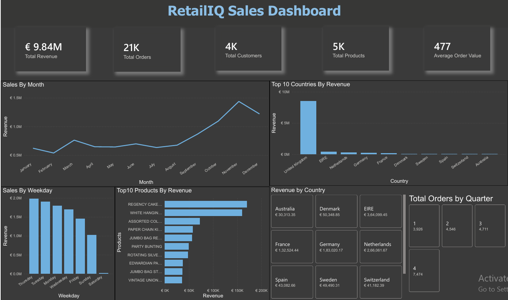

# 🛍️ RetailIQ - End-to-End Sales Analytics

An end-to-end retail sales analytics project that demonstrates the complete data analytics workflow using **Python**, **SQL Server**, and **Power BI**. The project transforms raw e-commerce transaction data into actionable business insights through data cleaning, SQL analysis, KPI reporting, and an interactive dashboard.

---

# 📌 Project Overview

RetailIQ analyzes retail sales transactions to answer key business questions such as:

- What is the total revenue generated?
- Which products generate the highest revenue?
- Which countries contribute the most sales?
- How does revenue change over time?
- Which weekdays and quarters perform best?

The project follows the complete analytics pipeline from raw data to business dashboard.

---

# 🚀 Project Workflow

```
Raw Dataset
     │
     ▼
Python Data Cleaning (Pandas)
     │
     ▼
SQL Server Database
     │
     ▼
Business Analysis using SQL
     │
     ▼
Power BI Dashboard
```

---

# 🛠️ Tech Stack

- Python
- Pandas
- SQL Server
- Power BI
- Git
- GitHub

---

# 📂 Repository Structure

```
RetailIQ-Sales-Analytics/
│
├── Data/
│   ├── Raw/
│   └── Cleaned/
│
├── Images/
│   └── RetailIQ_Sales_Dashboard.png
│
├── Notebooks/
│   └── 01_data_cleaning.ipynb
│
├── PowerBI/
│   └── RetailIQ.pbix
│
├── SQL/
│   ├── 00_KPIs.sql
│   ├── 01_sales_overview.sql
│   ├── 02_time_analysis.sql
│   ├── 03_product_analysis.sql
│   ├── 04_customer_analysis.sql
│   ├── 05_country_analysis.sql
│   └── 06_advanced_sql.sql
│
├── README.md
├── requirements.txt
└── .gitignore
```

---

# 📊 Dashboard Preview



---

# 📈 Dashboard KPIs

- 💶 Total Revenue
- 📦 Total Orders
- 👥 Total Customers
- 🛍️ Total Products
- 💰 Average Order Value

---

# 📊 Business Analysis

### Sales Overview
- Revenue KPIs
- Order statistics
- Customer statistics

### Time Analysis
- Monthly Revenue Trend
- Revenue by Weekday
- Orders by Quarter

### Product Analysis
- Top 10 Products by Revenue

### Customer Analysis
- Customer revenue analysis
- Average customer spending

### Country Analysis
- Top 10 Countries by Revenue
- Revenue distribution by country

### Advanced SQL
- Common Table Expressions (CTEs)
- Window Functions
- Ranking Functions
- Aggregate Analysis

---

# 💡 Key Insights

- The United Kingdom generated the highest revenue.
- November recorded the highest monthly revenue.
- A small number of products contributed a significant portion of total sales.
- Weekday sales consistently outperformed weekend sales.
- Revenue varied significantly across countries.

---

# ▶️ How to Run

1. Clone the repository

```bash
git clone https://github.com/bibin-33/RetailIQ-Sales-Analytics.git
```

2. Install Python dependencies

```bash
pip install -r requirements.txt
```

3. Run the Jupyter Notebook to perform data cleaning.

4. Execute the SQL scripts in SQL Server.

5. Open `RetailIQ.pbix` in Power BI Desktop to explore the interactive dashboard.

---

# 📚 Dataset

The project uses the **Online Retail II** transactional dataset containing international retail transactions, including invoices, products, customers, quantities, prices, and countries.

---

# 👨‍💻 Author

**Bibin Biju**

- GitHub: https://github.com/bibin-33
- LinkedIn: https://www.linkedin.com/in/bibinbiju27/

---

⭐ If you found this project useful, consider giving it a star!